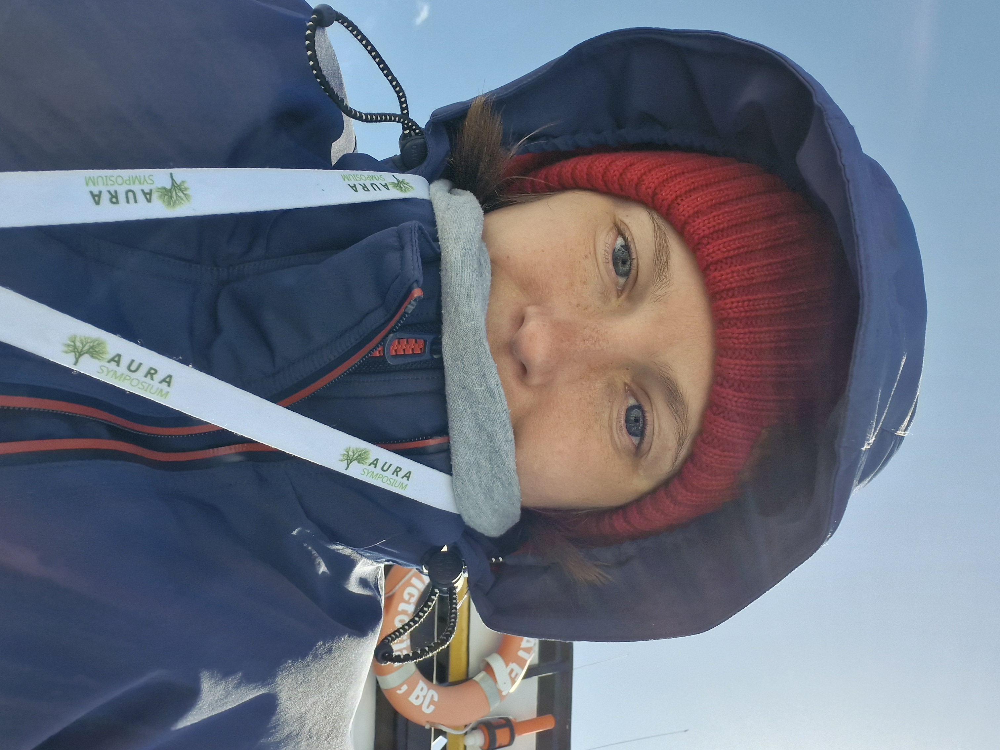

# Lucinda Kraufvelin

I am a PhD student in Environmental and Marine Biology at Åbo Akademi University.  
I use mesocosm experiments to study how temperature gradients and marine heatwaves affect temperate coastal ecosystems, from individual species to communities and their interactions.

**Keywords:**  
Extreme temperatures · Marine heatwaves · Mesocosms · Ecological networks · Trophic & non-trophic interactions

---

**Contact**  
 lukraufv@abo.fi  
 lukraufv.research@gmail.com  

**ORCID:**  
https://orcid.org/0000-0002-1437-6856
